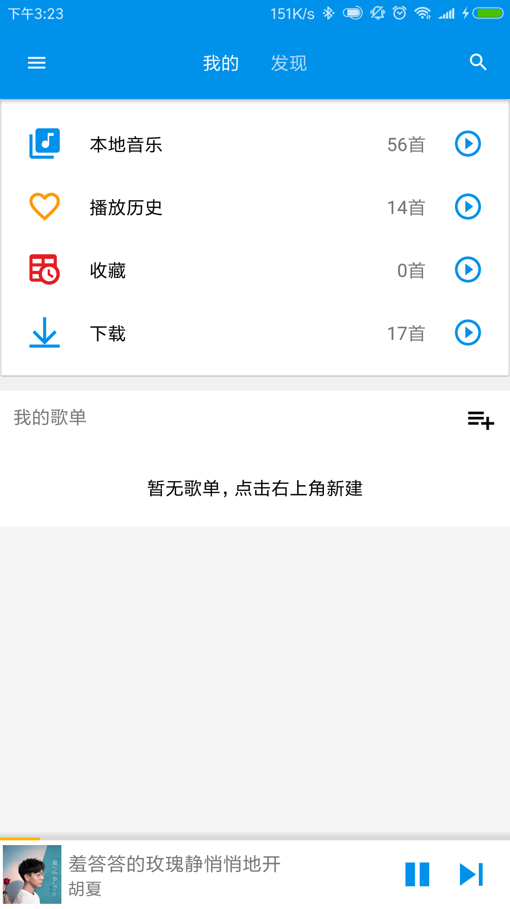
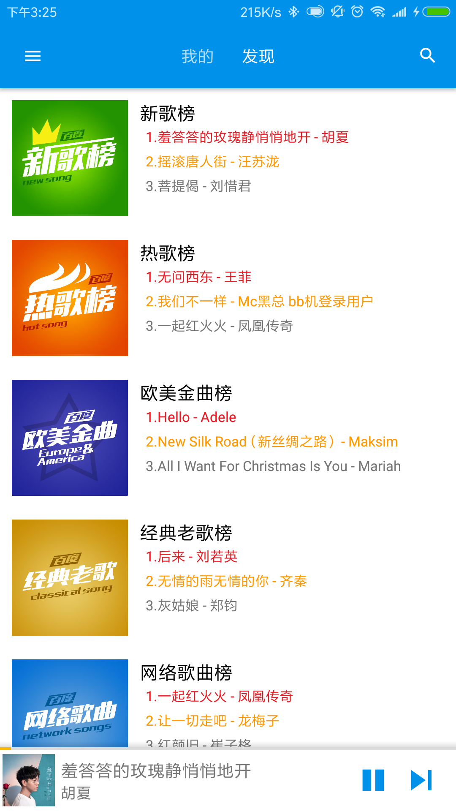
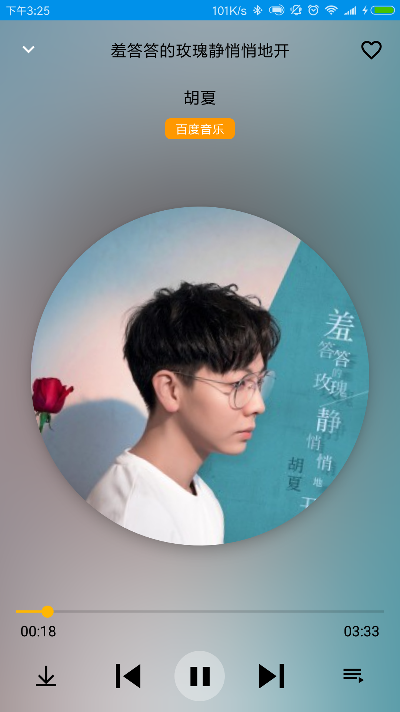
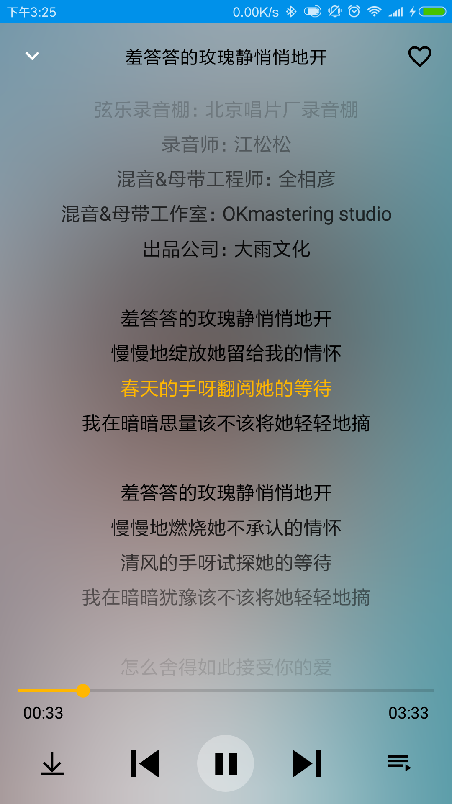
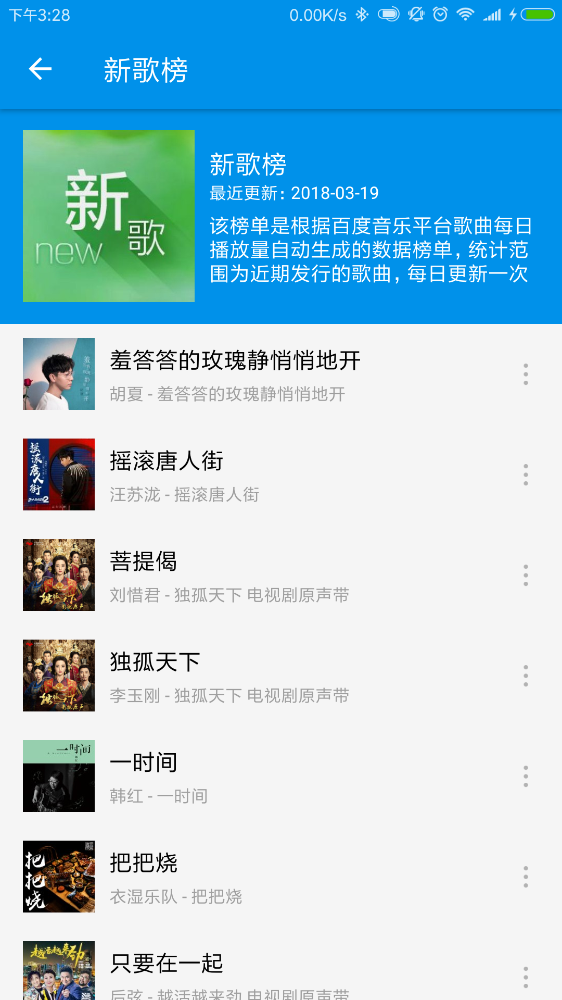

# MusicLake
Android 音乐播放器，基于MVP + Retrofit + Rxjava2 框架。代码重构了一次，还是发现还有很多不足的地方。

# 已完成功能

- [x] 本地听歌。按专辑、歌手、文件夹分类
- [x] 在线听歌。百度音乐，QQ音乐、虾米音乐
- [x] 本地歌单
- [x] 播放历史
- [x] 播放队列
- [x] 网络歌曲下载
- [x] 播放歌词、桌面歌词
- [x] 通知栏控制，线控播放
- [x] QQ登录（因后台数据库没有部署，暂时没用）

# 项目运行截图

