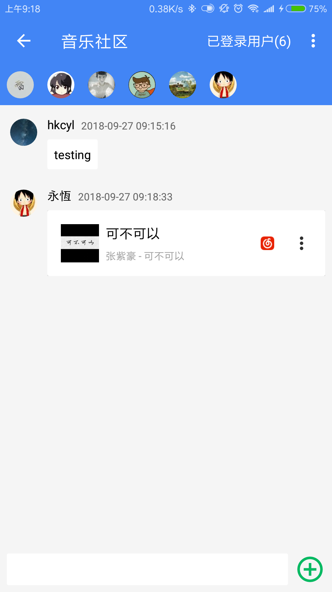

# MusicLake 

# 免责声明
- 音乐湖只用作个人学习研究，禁止用于商业及非法用途，如产生法律纠纷与本人无关
- 音乐api来自于github，非官方版api，本软件不提供任何音频存储服务，如需下载音频，请支持正版！。
- 音乐版权归各网站所有，本站不承担任何法律责任和连带责任。如果已经涉及到您的版权，请速与本站管理员联系，我们将第一时间为你处理。

# 功能版本
- Android 音乐播放器 （最低支持Android版本5.0）
- 本地音乐播放，百度音乐，QQ音乐、虾米音乐、网易云音乐等网络音乐在线播放
- 歌词播放、桌面歌词、桌面小控件
- 通知栏控制、线控播放、音频焦点控制
- QQ登录、在线歌单同步
- 百度电台列表，网易云mv排行榜，mv播放评论
- 酷狗歌词搜索、修改歌词样式
- 精力有限，需求不饱和都会逐步完善，有兴趣可赏个star静等完善与bug修复，期望的功能也可提[issues](https://github.com/caiyonglong/MusicLake/issues)
- [PC端](https://github.com/sunzongzheng/music)
- [版本计划](https://github.com/caiyonglong/MusicLake/projects)
- [下载页](https://github.com/caiyonglong/MusicLake/releases)
- [蒲公英下载](https://www.pgyer.com/ZIWH)
- [更新日志](RELEASENOTE.md)

# 相关项目|音乐API
- [音乐API](https://github.com/sunzongzheng/musicApi)
- [云歌单API](https://github.com/sunzongzheng/player-be)
- [NeteaseCloudMusicApi](https://github.com/Binaryify/NeteaseCloudMusicApi)

# 第三方库

- [rxjava](https://github.com/ReactiveX/RxJava)
- [retrofit](https://github.com/square/retrofit)
- [dagger2](https://github.com/google/dagger)
- [Glide](https://github.com/bumptech/glide)
- [LitePal](https://github.com/LitePalFramework/LitePal)
- [DSBridge](https://github.com/wendux/DSBridge-Android)
- [BaseRecyclerViewAdapterHelper](https://github.com/CymChad/BaseRecyclerViewAdapterHelper)
- [More..](https://github.com/caiyonglong/MusicLake/blob/develop/app/build.gradle)

# 软件运行截图

