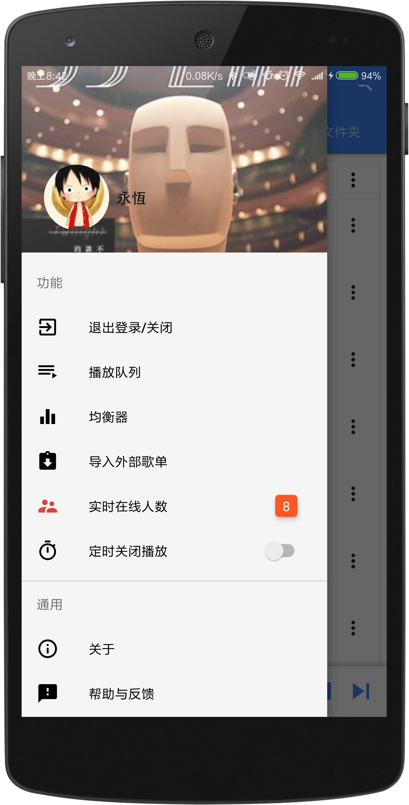

# MusicLake
- Android 音乐播放器
- 本地音乐播放，百度音乐，QQ音乐、虾米音乐、网易云音乐等网络音乐播放
- 支持在线歌曲下载
- 歌词播放、桌面歌词、桌面小控件
- 通知栏控制、线控播放、音频焦点控制
- QQ登录、在线歌单同步
- 百度电台列表，网易云mv排行榜，mv播放评论
- 酷狗歌词搜索、修改歌词样式
- 更多体验请[下载apk](https://github.com/caiyonglong/MusicLake/releases)，欢迎star，尽情提[#issues](https://github.com/caiyonglong/MusicLake/issues)

# 更新日志
[查看](RELEASENOTE.md)

# 下载
[点这下载](https://github.com/caiyonglong/MusicLake/releases)

# 相关项目|音乐API
- [PC端](https://github.com/sunzongzheng/music)
- [音乐API](https://github.com/sunzongzheng/musicApi)
- [Binaryify/NeteaseCloudMusicApi](https://github.com/Binaryify/NeteaseCloudMusicApi)

# 软件运行截图

