# MusicLake 

# 因收到网易云音乐和QQ音乐的官方警告函，我们已关闭app的相关api服务,不再提供任何apk。
- 音乐api可以下载 [app.native.js](https://github.com/sunzongzheng/musicApi/blob/master/dist/app.native.js)保存到本地，替换掉MusicLake/musicapi/src/main/assets/musicApi.html中的 js文件
- 有服务器的可以自己搭建 [NeteaseCloudMusicApi](https://github.com/Binaryify/NeteaseCloudMusicApi) 。

# 免责声明
- 音乐湖只用作个人学习研究，禁止用于商业及非法用途，如产生法律纠纷与本人无关
- 音乐api来自于github，非官方版api，本软件不提供任何音频存储服务，如需下载音频，请支持正版！。
- 音乐版权归各网站所有，本站不承担任何法律责任和连带责任。如果已经涉及到您的版权，请速与本站管理员联系，我们将第一时间为你处理。
- MusicLake 并不是一个破解软件，不提供下载付费歌曲！

版权声明
--------
“QQ”、“QQ音乐”及企鹅形象等文字、图形和商业标识，其著作权或商标权归腾讯公司所有。
QQ音乐享有对其平台授权音乐的版权，请勿随意下载，复制版权内容。具体内容请参考QQ音乐用户协议。

“虾米”、“虾米音乐”等文字、图形和商业标识，其著作权或商标权归阿里公司所有。
虾米音乐享有对其平台授权音乐的版权，请勿随意下载，复制版权内容。具体内容请参考虾米音乐用户协议。

“网易云”、“网易云音乐”等文字、图形和商业标识，其著作权或商标权归网易所有。
网易云音乐享有对其平台授权音乐的版权，请勿随意下载，复制版权内容。具体内容请参考网易云音乐用户协议。

# 功能版本
- Android 音乐播放器(本地/在线播放) （最低支持Android版本5.0）
- 支持多平台音乐源，百度音乐，虾米音乐、网易云音乐
- 歌词播放、桌面歌词、桌面小控件
- 通知栏控制、线控播放、音频焦点控制
- QQ登录、微博登陆、在线歌单同步
- 网易云热门歌手，百度电台列表，网易云mv排行榜，mv播放评论
- 酷狗歌词搜索、修改歌词样式、歌词翻译
- 精力有限，需求不饱和都会逐步完善
- [PC端](https://github.com/sunzongzheng/music)
- [版本计划](https://github.com/caiyonglong/MusicLake/projects)
- [下载页](https://github.com/caiyonglong/MusicLake/releases)
- [交流群:549939157](https://jq.qq.com/?_wv=1027&k=5XrNrCJ)

### 有兴趣可给个star，支持一下哦！
持续更新，有什么问题可以提[issues](https://github.com/caiyonglong/MusicLake/issues)！

# *新功能*
- 新增夜间模式
- setting界面 后台音乐接口，网易云音乐API接口可配置
- 增加网易云音乐账号绑定（手机号登陆），每日推荐，歌单广场，网易云歌单列表
- 增加本地歌单
- 优化定时界面

# 计划
- [ ] 整理文档
- [ ] 代码重构
 
# 相关项目|音乐API
- [音乐API](https://github.com/sunzongzheng/musicApi)
- [云歌单API](https://github.com/sunzongzheng/player-be)
- [NeteaseCloudMusicApi](https://github.com/Binaryify/NeteaseCloudMusicApi)

# 第三方库

- [rxjava](https://github.com/ReactiveX/RxJava)
- [retrofit](https://github.com/square/retrofit)
- [dagger2](https://github.com/google/dagger)
- [Glide](https://github.com/bumptech/glide)
- [LitePal](https://github.com/LitePalFramework/LitePal)
- [DSBridge](https://github.com/wendux/DSBridge-Android)
- [BaseRecyclerViewAdapterHelper](https://github.com/CymChad/BaseRecyclerViewAdapterHelper)
- [More..](https://github.com/caiyonglong/MusicLake/blob/develop/app/build.gradle)

# 软件运行截图

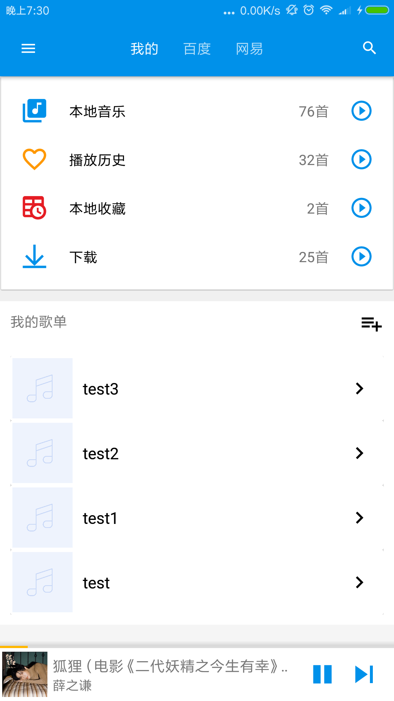

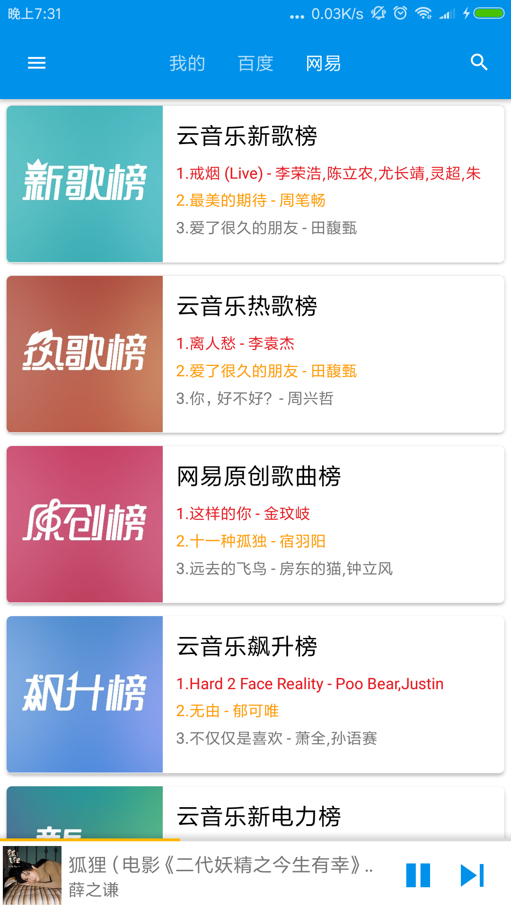
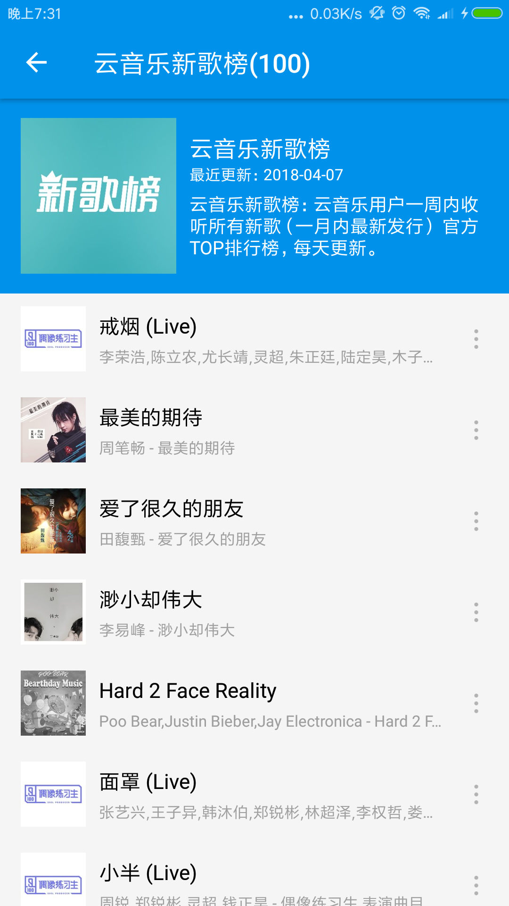
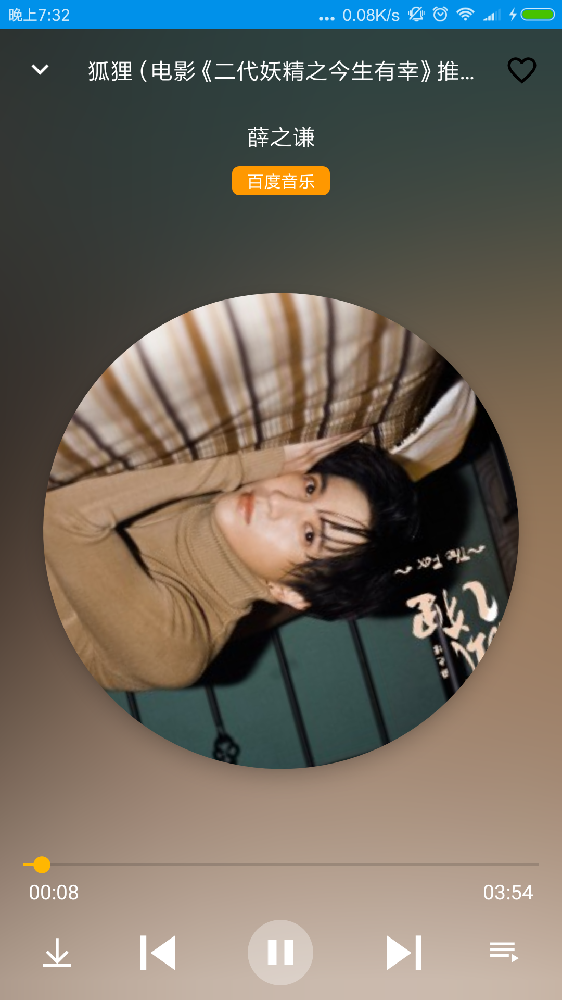
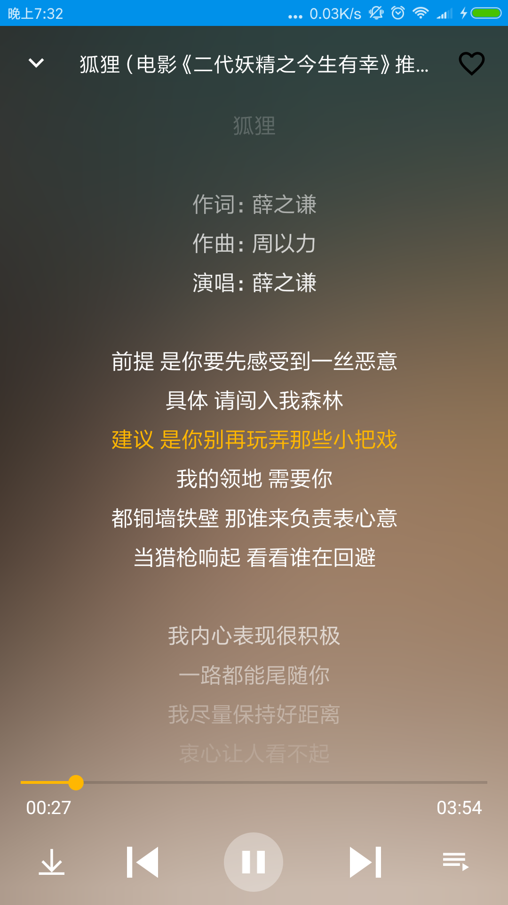
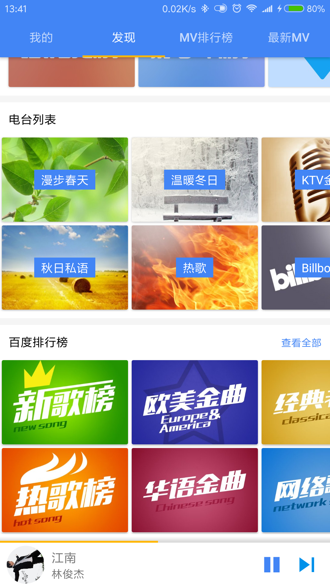
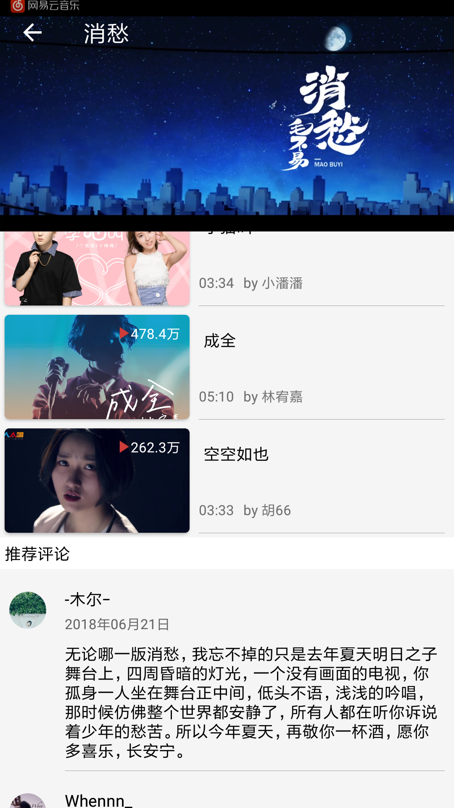
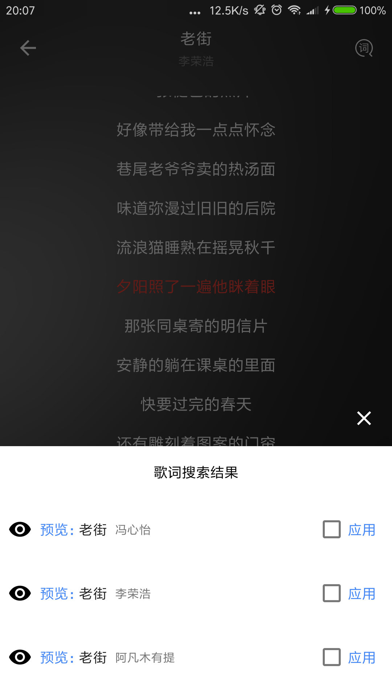
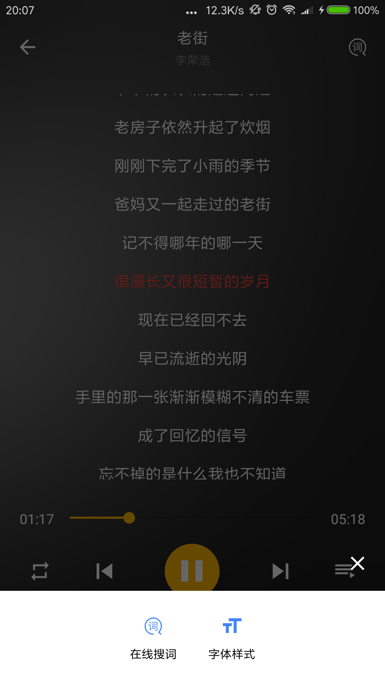
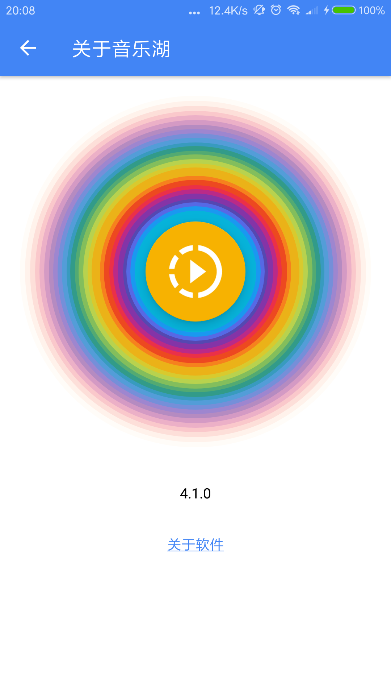
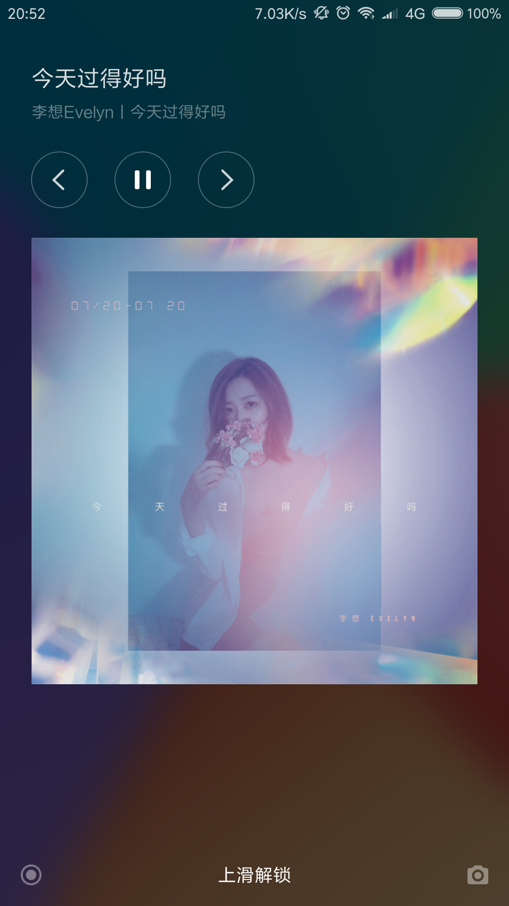
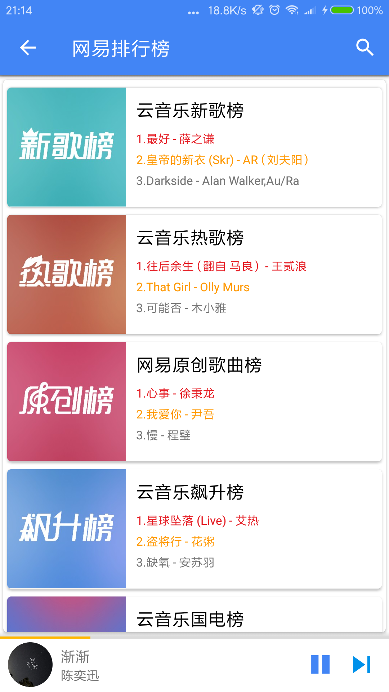

- 夜间模式相关截图

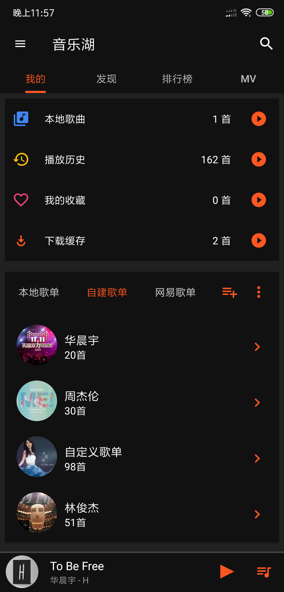
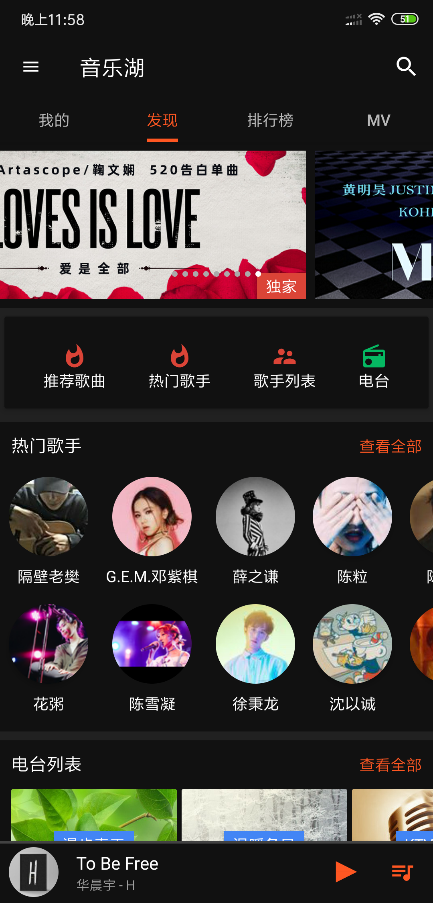

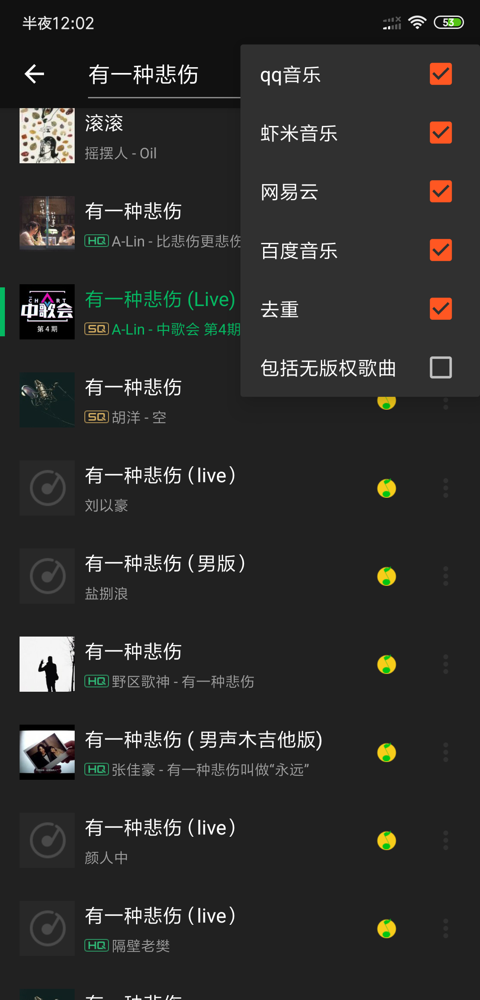

## :moneybag: 捐赠
捐赠会有两个用途
- 请允许我买杯咖啡 :coffee:
- 接口维护，微信三方登陆接入
- 微信:

- 支付宝:

